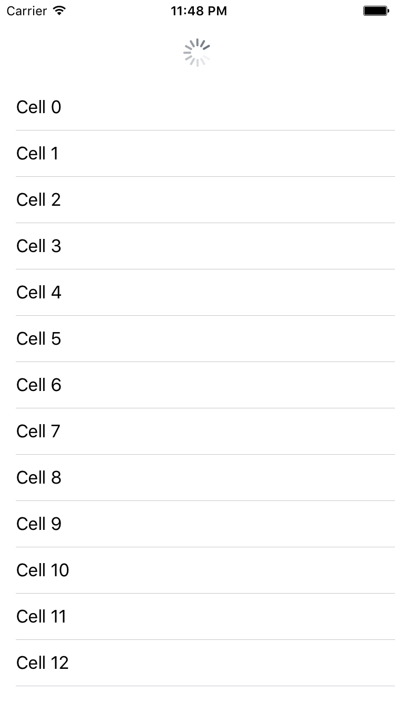
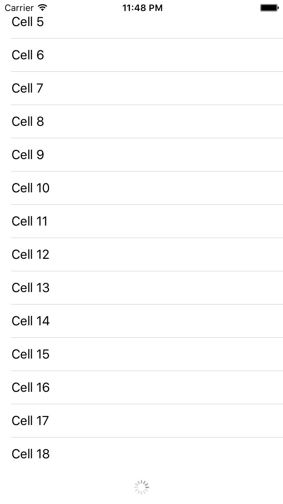
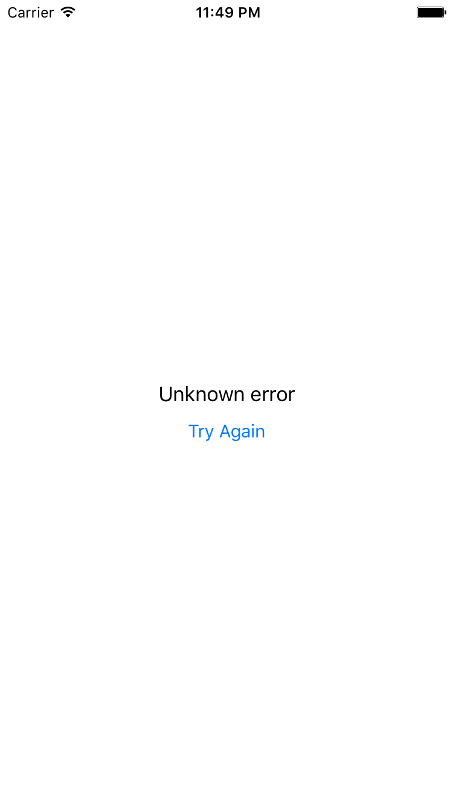

# StatefulTableView
[](http://cocoadocs.org/docsets/StatefulTableView)
[](http://cocoadocs.org/docsets/StatefulTableView)
[](http://cocoadocs.org/docsets/StatefulTableView)
[](http://cocoadocs.org/docsets/StatefulTableView)
[](https://travis-ci.org/timominous/StatefulTableView)

Custom UITableView container class that supports pull-to-refresh, load-more, initial load, and empty states. This library aims to be a drop in replacement for `UITableView`. Swift port of [SKStatefulTableViewController](http://github.com/shiki/SKStatefulTableViewController).

This is a *work in progress*. A lot of things may break as of the moment.

## Screenshots

Initial loading:


Pull-to-refresh:



Load more:



Initial load error:



Load more error:


## Usage

Currently, you can only assign the delegates and data source through code.

```swift
tableView.dataSource = self // Confofrms to UITableViewDataSource
tableView.delegate = self // Conforms to UITableViewDelegate
tableView.statefulDelegate = self // Conforms to StatefulTableDelegate
```

For initial loading, pull-to-refresh, and load more, you have to implement the following statefulDelegate methods:

```swift
func statefulTableViewWillBeginInitialLoad(tvc: StatefulTableView, handler: InitialLoadCompletionHandler)
func statefulTableViewWillBeginLoadingFromRefresh(tvc: StatefulTableView, handler: InitialLoadCompletionHandler)
func statefulTableViewWillBeginLoadingMore(tvc: StatefulTableView, handler: LoadMoreCompletionHandler)
```

To show custom views, return them through the following statefulDelegate methods. Otherwise, return `nil`.

```swift
func statefulTableViewViewForInitialLoad(tvc: StatefulTableView) -> UIView?
func statefulTableViewInitialErrorView(tvc: StatefulTableView, forInitialLoadError: NSError?) -> UIView?
func statefulTableViewLoadMoreErrorView(tvc: StatefulTableView, forLoadMoreError: NSError?) -> UIView?
```

## Installation

### Cocoapods

Add this to your Podfile.

```ruby
pod 'StatefulTableView', '0.0.17'
```

### Credits

* [SKStatefulTableViewController](http://github.com/shiki/SKStatefulTableViewController) by [shiki](http://github.com/shiki)
